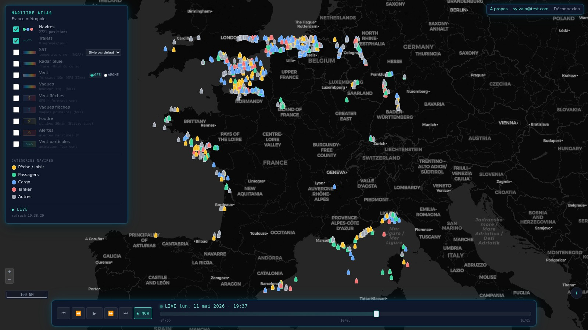
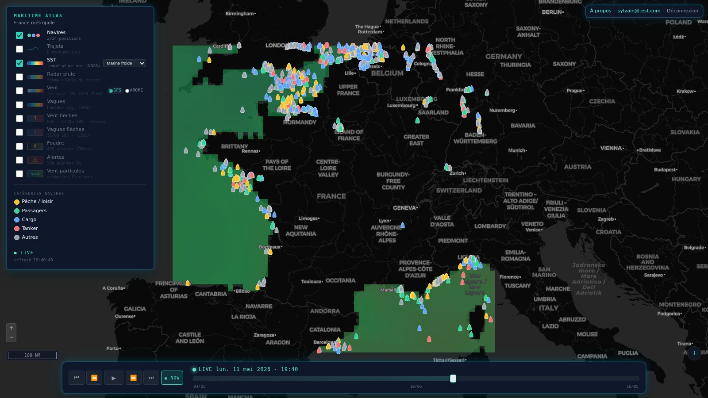
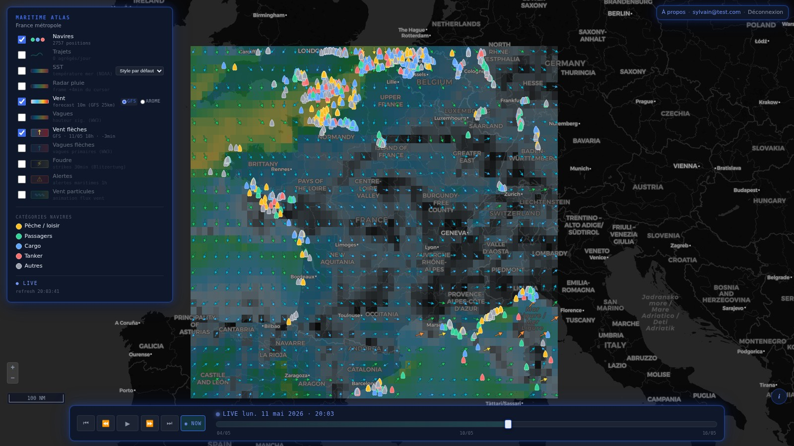
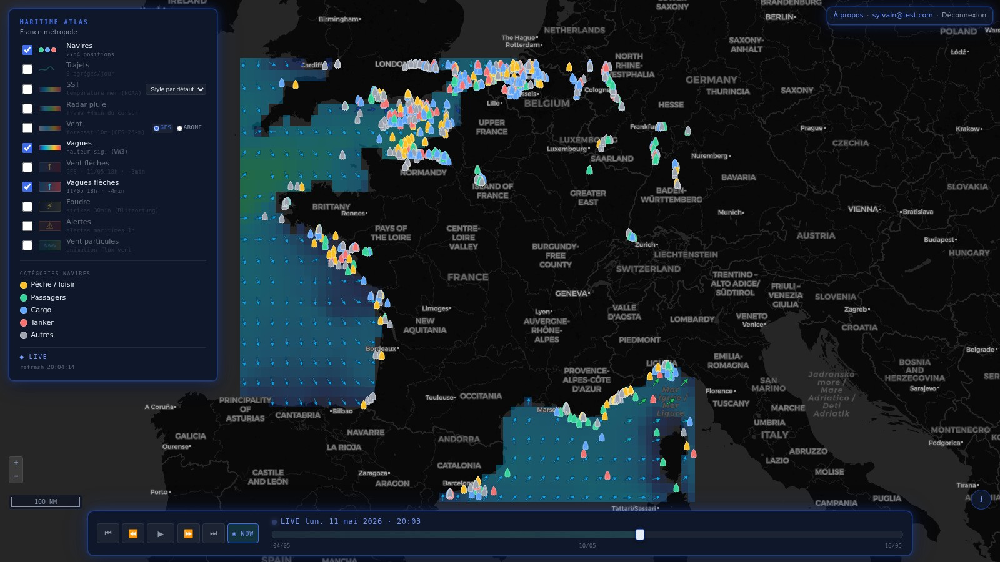
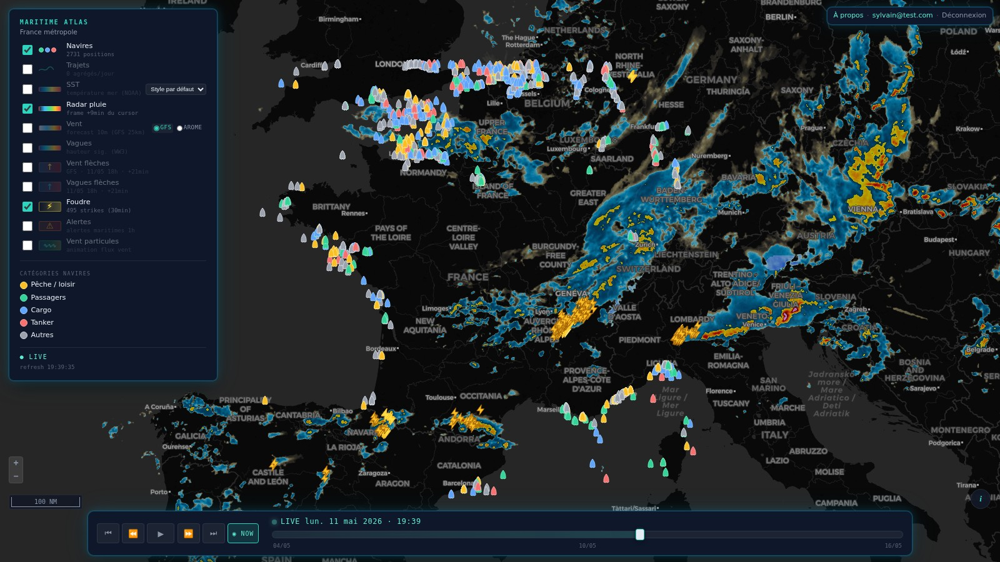
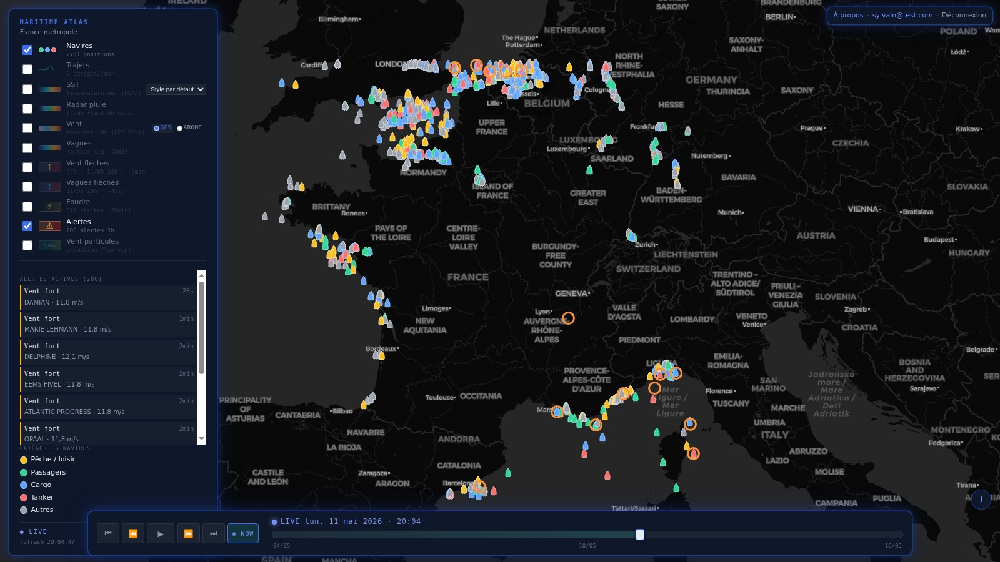
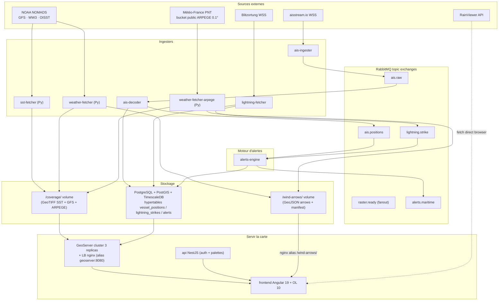
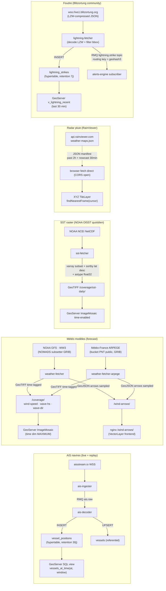
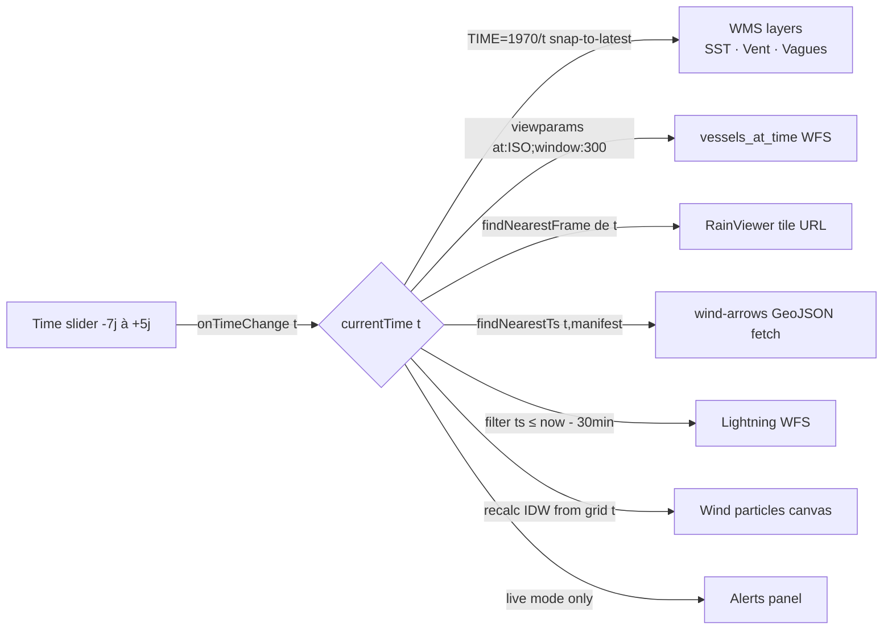

# Maritime Atlas

[](https://claude.com/claude-code)
[](https://claude.com/claude-code)
[](https://angular.dev)
[](https://openlayers.org)
[](https://nestjs.com)
[](https://geoserver.org)
[](https://www.timescale.com)
[](https://www.rabbitmq.com)
[](LICENSE)

> Atlas maritime live multi-source — AIS navires, météo NOAA + Météo-France,
> radar pluie, foudre Blitzortung, alerts engine RabbitMQ. France métropole.
>
> **100% du code écrit en pair-programming avec [Claude Code](https://claude.com/claude-code).**
> Premier projet *solo avec Claude* — pas de ChatGPT pour les visuels, pas de
> Copilot pour le code. Voir la page [/about](https://maritime.sladoire.dev/about)
> du site live pour le récit complet.

Atlas live du trafic maritime et de l'environnement marin sur la **France métropolitaine**
(façades Manche, Atlantique, Méditerranée).

Suivi temps réel des navires (AIS), température de surface (SST), vent et vagues
prévus à +72h, pluie radar live. Architecture microservices avec ingestion
multi-source, RabbitMQ comme glue, GeoServer pour servir les layers raster/WFS,
Angular + OpenLayers pour la viz, NestJS + Drizzle pour l'auth et les palettes
utilisateur.

## Aperçu

> Tous les layers se synchronisent sur le **time slider unique** en bas — un
> signal Angular écouté par 7 sous-systèmes (WMS, WFS, RainViewer, GeoJSON arrows,
> particules, alertes, lightning).

| Layer | Source | Aperçu |
|---|---|---|
| **Navires AIS** (silhouettes colorées par catégorie : pêche, passagers, cargo, tanker, autres) | aisstream.io WSS, ~2700 positions live |  |
| **SST** — température de surface de la mer | NOAA OISST quotidien, GeoTIFF time-tagged |  |
| **Vent** raster + flèches direction | NOAA GFS 25km / Météo-France ARPEGE 11km (sprint Europe), forecasts +72h |  |
| **Vagues** raster + flèches direction | NOAA WaveWatch III, Hs + DIRPW |  |
| **Radar pluie** + **foudre** | RainViewer XYZ tiles + Blitzortung WSS (LZW JSON) |  |
| **Alertes maritimes** (panel + cercles colorisés) | alerts-engine croise AIS × foudre × vent fort via RMQ |  |

### Particules de vent — flux animé

Sprint 8 : layer custom OpenLayers + canvas, ~2500 particules advectées par
interpolation IDW sur 4 plus-proches voisins du grid GFS/ARPEGE, trails alpha pour
créer l'illusion de courants.

https://github.com/Sylad/maritime-atlas/raw/main/docs/screenshots/07-particles.mp4

> Le MP4 est dans [`docs/screenshots/07-particles.mp4`](docs/screenshots/07-particles.mp4).
> GitHub n'autoplay pas les MP4 inline dans les README ; cliquer ouvre le player.

## Architecture

```
                                                                  ┌──────────────────┐
[aisstream.io WS] ──► [ais-ingester] ──► [RabbitMQ ais.raw] ──►   │   PostGIS +      │
                                              │                   │   TimescaleDB    │
                                              ▼                   │                  │
                                       [ais-decoder]  ──UPSERT──► │  vessel_positions│
                                              │                   │  vessels         │
                                              ▼                   │  vessel_tracks_  │
                                       [ais.positions]            │     daily        │
                                                                  │  users/palettes  │
              ┌───────────[track-builder cron hourly]──────────►  └─────────┬────────┘
              │                                                             │
              │                                                             │
[NOAA OISST]──┤                                                             │
              ▼                                                             │
       [sst-fetcher Python] ──GeoTIFF──┐                                    │
                                       │                                    │
[NOAA GFS + WW3]                       ▼                                    │
       │                          /coverage/  (volume partagé)              │
       ▼                               │                                    │
   [weather-fetcher Python] ───────────┤                                    │
       │                               ▼                                    │
       │                         ┌──────────────────┐                       │
       └─wind/wave arrows GeoJSON│   GeoServer 2.27 │ ◄─REST provision──────┘
                       │         │   (WMS/WFS/WMTS) │
                       ▼         └────────┬─────────┘
              /wind-arrows/ (vol)         │
                       │                  ▼ WMS time + WFS
                       └─────────►  ┌──────────────────────────┐
                                    │  Angular 19 + OL 10      │  ◄── REST auth/palettes
                                    │  (nginx /api → api,      │      ┌─────────────┐
                                    │   /geoserver → geoserver)│ ◄────│ api NestJS  │
                                    └──────────────────────────┘      │  Drizzle    │
                                                                      │  JWT 24h    │
                                                                      └─────────────┘
                                                  +  [RainViewer XYZ tiles, direct browser]
```

## Services Docker compose

| Service | Tech | Port hôte | Rôle |
|---|---|---|---|
| `postgres` | timescaledb-ha:pg16 | 15432 | PostGIS + TimescaleDB, hypertable `vessel_positions`, tables users/palettes |
| `rabbitmq` | rabbitmq:3.13-management | 5672 / 15672 | Glue messaging `ais.raw` → `ais.positions` |
| `seaweedfs` | chrislusf/seaweedfs:3.97 | 8333 | S3-compatible object store (master+volume+filer+S3 en 1 container). Backend pour GWC tiles + COG rasters (à venir) |
| `geoserver-1/2/3` | maritime-geoserver:2.28.2-with-gwc-s3 (×3 replicas, custom image) | — | Cluster WMS/WFS/WMTS + GWC-S3 cache. Build local depuis docker.osgeo.org/geoserver:2.28.2 + extraction du gwc-s3-plugin SourceForge |
| `geoserver` | nginx:alpine (LB interne) | 8080 | Load balancer ip_hash devant les 3 replicas — alias DNS rétro-compat |
| `geoserver-provisioner` | alpine/curl (one-shot) | — | Crée workspace + datastore + layers + styles via REST (idempotent) |
| `ais-ingester` | NestJS 11 | — | WS aisstream.io → publish `ais.raw` (bbox France métropole) |
| `ais-decoder` | NestJS 11 | — | Consume `ais.raw` → normalise → INSERT PostGIS + UPSERT vessels |
| `track-builder` | NestJS 11 | — | Cron horaire (xx:35) `vessel_positions` → `vessel_tracks_daily` (LineStrings) |
| `sst-fetcher` | Python (xarray + rioxarray) | — | Cron quotidien 06:00 UTC, NOAA OISST → GeoTIFF mosaic store |
| `weather-fetcher` | Python (cfgrib + xarray) | — | Cron 4×/jour, GFS (vent 10m) + WW3 (HTSGW + DIRPW), forecasts +72h, GeoTIFF + GeoJSON arrows |
| `weather-fetcher-arpege` | Python (cfgrib + xarray) | — | **Sprint Europe Chantier #2** (remplace l'ex-`weather-fetcher-arome` FR-only). Cron 4×/jour, Météo-France ARPEGE 0.1° (~11km) sur Europe étroite en parallèle du GFS 25km, forecasts +48h, layer `wind-speed-arpege` |
| `api` | NestJS 11 + Drizzle | — | Auth JWT 24h · CRUD palettes (max 5/user) · vérif email Resend · Google OAuth (`/auth/google`) · RBAC admin (`/admin/users` list/promote/delete) · cron dormants 03:00 Europe/Paris |
| `frontend` | Angular 19 + nginx | 4204 | UI map, nginx proxy `/api/` et `/geoserver/` (CORS-free) |

## Stack technique

| Couche | Tech |
|---|---|
| Storage | PostgreSQL 16 + PostGIS 3.4 + TimescaleDB (hypertable retention 30j) |
| Messaging | RabbitMQ 3.13 (`ais.raw` direct, `ais.positions` topic) |
| Tile/WFS server | GeoServer 2.27 (image mosaic stores time-aware pour rasters) |
| Backend | NestJS 11 + TypeScript 5, Drizzle ORM (api), amqplib (ais), node-cron (track-builder) |
| Raster pipeline | Python 3 + xarray + rioxarray + cfgrib + gdal natif |
| Frontend | Angular 19 + OpenLayers 10 + nginx alpine |
| Sources externes | aisstream.io · NOAA OISST · NOAA GFS · NOAA WaveWatch III · Météo-France ARPEGE (data.gouv.fr) · RainViewer |
| Auth | JWT (`@nestjs/jwt`) 24h · bcrypt · vérification email via **Resend SDK** · Google OAuth 2.0 (`passport-google-oauth20`) · RBAC 2 rôles (`user` / `admin`) · cron dormants 90j (`DormantCleanupService`) |
| Build | Docker multi-stage par service |

## Sprints livrés

| Sprint | Livrable |
|---|---|
| **1** | AIS → PostGIS hypertable + GeoServer scaffold |
| **1.5** | Angular 19 + OpenLayers UI, WFS `v_vessels_live`, TTL retention 30j |
| **2** | `track-builder` cron horaire + bbox étendue France métropole `[-6, 41, 10, 51.5]` |
| **3** | SST raster (NOAA OISST quotidien) + time slider globale + replay temporel passé |
| **4a** | `weather-fetcher` Python — GFS vent 10m + WW3 vagues (Hs + direction), forecasts +72h |
| **4b** | Radar pluie via RainViewer (XYZ tiles time-aware, **sans backend**, direct browser) |
| **5** | API NestJS + Drizzle + JWT, palettes utilisateur (max 5/user), miroir GeoServer styles |
| **6** | Flèches vent (GFS) + flèches vagues (WW3) — VectorLayer GeoJSON via volume partagé |
| **Auth refonte** | Schema users `username` + `email_verified_at` + `role` + cron dormants · Google OAuth (`passport-google-oauth20`) · vérif email Resend SDK · `AdminUsersController` `/admin/users` list/promote/delete · RBAC 2 rôles strict |

## Bbox

```
France métropolitaine élargie
SW: (41.0°N,  -6.0°W)   NE: (51.5°N, 10.0°E)
```

Couvre Manche, Atlantique (Bretagne + golfe de Gascogne), Méditerranée occidentale,
mer du Nord sud.

## Démarrer

### 1. Prérequis

- Docker + Docker Compose
- Une API key gratuite sur [aisstream.io](https://aisstream.io) (créer un compte → settings)

### 2. Configuration

```bash
cp .env.example .env
# Édite .env, renseigne AISSTREAM_API_KEY et un JWT_SECRET solide
```

### 3. Boot

```bash
docker compose up -d --build

# Vérifier que tout est sain :
docker compose ps
docker compose logs -f ais-ingester ais-decoder
```

Le sidecar `geoserver-provisioner` crée automatiquement workspace, datastore PostGIS,
layers et styles dès que GeoServer répond. Aucune étape manuelle dans l'admin UI.

### 4. Smoke tests

```bash
# Postgres : devrait afficher des MMSI au bout de quelques secondes
docker compose exec postgres psql -U maritime -d maritime -c \
  "SELECT count(*) FROM vessel_positions WHERE ts > now() - interval '1 minute';"

# RabbitMQ Management UI : http://localhost:15672 (maritime / maritime)
# GeoServer :              http://localhost:8080/geoserver (admin / geoserver)
# Frontend Angular :       http://localhost:4204
```

## Sources de données

| Donnée | Source | Format | Fréquence | Sprint |
|---|---|---|---|---|
| Positions AIS | aisstream.io | JSON WS | seconde | 1 |
| Détails navires | aisstream `ShipStaticData` | JSON WS | event | 1 |
| SST | NOAA OISST v2.1 (AWS) | NetCDF → GeoTIFF | quotidien | 3 |
| Vent 10m (global) | NOAA GFS (NOMADS subsetter) | GRIB → GeoTIFF + GeoJSON | 4×/jour | 4a / 6 |
| Vent 10m (Europe) | Météo-France ARPEGE 0.1° (bucket PNT) | GRIB → GeoTIFF + GeoJSON | 4×/jour | Europe #2 |
| Vagues (Hs + dir) | NOAA WaveWatch III | GRIB → GeoTIFF + GeoJSON | 4×/jour | 4a / 6 |
| Radar pluie | RainViewer | XYZ tiles | 10 min | 4b |
| Foudre | Blitzortung WSS (LZW JSON) | event WS → PostGIS | continu | 7 |

### Pipelines d'ingestion détaillés

Le frontend ne tape qu'**un seul backend public** : le LB GeoServer (alias DNS
`geoserver:8080`). Toute la complexité d'ingestion vit en aval — 6 services
indépendants, plus le moteur d'alertes qui croise plusieurs flux via RabbitMQ.



### Détail par pipeline



### Time slider — comment tout se synchronise



Le slider est l'unique source de vérité côté frontend : un signal Angular qui
émet à chaque déplacement du cursor, écouté par 7 sous-systèmes qui se
rafraichissent indépendamment. Pas de polling synchrone — chaque source a son
propre cache de timestamp et debounce.

### TTL différentiels (sprint 10b)

| Donnée | TTL | Mécanisme |
|---|---|---|
| `vessel_positions` | 30 j | TimescaleDB `add_retention_policy` |
| SST GeoTIFF | 30 j | `cleanup_old_files()` cron Python |
| Weather GeoTIFF + GeoJSON | 7 j | idem (forecasts deviennent obsolètes vite) |
| `lightning_strikes` | 7 j | TimescaleDB retention |
| `alerts` | 14 j | TimescaleDB retention (analyse rétroactive incident) |
| RainViewer | -2h / +30min | géré côté RainViewer, on consomme juste |

## Cluster GeoServer (sprint 9)

Depuis le sprint 9, GeoServer tourne en **3 replicas** (`geoserver-1/2/3`) avec
**catalog partagé en Postgres** via les community extensions `jdbcconfig`
+ `jdbcstore`. Un nginx interne fait load balancer et garde l'alias DNS
`geoserver:8080` pour les services métier (provisioner, weather-fetcher,
api, …) — zéro modif côté services existants.

```
                                       ┌─ geoserver-1 ─┐
[frontend nginx /geoserver/]           │               │
[services métier (api, fetchers)]  ──► │ geoserver:8080│  (LB nginx, ip_hash)
                                       │  upstream     │ ──► geoserver-1
                                       │  cluster      │ ──► geoserver-2
                                       └───────────────┘ ──► geoserver-3
                                                                  │
                                                                  ▼
                                                      ┌────────────────────────┐
                                                      │ Postgres `maritime`    │
                                                      │  schema `geoserver`    │
                                                      │  (JDBCConfig tables)   │
                                                      └────────────────────────┘
```

### Décisions d'archi

| Choix | Pourquoi |
|---|---|
| JDBCConfig + JDBCStore (community) | Vrai pattern enterprise GeoServer. Catalog = source de vérité en DB, replicas stateless. Alternative (volume partagé seul) marche mais reste fragile sur les SLD/styles. |
| Même DB `maritime`, schema dédié `geoserver` | Un seul Postgres à backup / monitorer. Schema isole bien les concerns. |
| nginx `ip_hash` (sticky) pour l'UI admin | JDBCSessionDataStore (Jetty) demande de patcher le WAR de l'image officielle. Sticky atteint le même but UX (UI cohérente) avec un compromis acceptable : un user reste sur le même replica le temps de sa session. Round-robin reste possible côté API REST (catalog en DB, donc stateless). |
| LB nginx interne, alias `geoserver` | Permet de garder l'API stable pour tous les services existants. Pas besoin de toucher au provisioner, à weather-fetcher, sst-fetcher, api ou frontend. |

### Variables d'environnement

Rien à ajouter pour les credentials cluster — JDBCConfig réutilise
`POSTGRES_USER`/`POSTGRES_PASSWORD`/`POSTGRES_DB` déjà présents dans `.env`.
Optionnel : `SKIP_CLUSTER_CHECK=1` côté provisioner pour passer outre le
sanity check des 3 replicas.

### Smoke tests cluster

```bash
# 1. Les 3 replicas répondent à /rest/about/status
for n in 1 2 3; do
  docker compose exec geoserver-${n} \
    curl -sf -u admin:geoserver http://localhost:8080/geoserver/rest/about/status \
    | jq -r '.about.resource[0].version' \
    && echo "  → geoserver-${n} OK"
done

# 2. Création d'un workspace de test sur geoserver-1, visible sur geoserver-2
docker compose exec geoserver-1 \
  curl -sf -u admin:geoserver -X POST http://localhost:8080/geoserver/rest/workspaces \
  -H "Content-Type: application/json" -d '{"workspace":{"name":"cluster-test"}}'

docker compose exec geoserver-2 \
  curl -sf -u admin:geoserver http://localhost:8080/geoserver/rest/workspaces/cluster-test.json
# → 200 + JSON = catalog bien partagé via JDBCConfig

# Cleanup
docker compose exec geoserver-1 \
  curl -sf -u admin:geoserver -X DELETE http://localhost:8080/geoserver/rest/workspaces/cluster-test
```

### Reset complet du cluster

Si le catalog JDBCConfig est corrompu (init partielle, schema verrouillé) :

```bash
docker compose down
docker volume rm maritime-atlas_geoserver-data
docker compose exec postgres psql -U maritime -d maritime -c \
  "DROP SCHEMA geoserver CASCADE; CREATE SCHEMA geoserver;"
docker compose up -d
# → re-bootstrap JDBCConfig + re-provisioning via le sidecar (workspace, layers, styles)
```

## Limitations & roadmap

- **Bbox figée à la France métropole** — élargir nécessite re-baseline des hypertables.
- **Retention 30j** sur `vessel_positions` (TimescaleDB), historique long via `vessel_tracks_daily`.
- **Sticky sessions ip_hash** plutôt que vraies sessions partagées Jetty — voir Cluster GeoServer ci-dessus pour le compromis.

Pistes prochaines :

| Sprint | Idée |
|---|---|
| **7** | Foudre live (Blitzortung WebSocket ou source équivalente), VectorLayer animée |
| **8** | Particules vent style Windy.com (WebGL custom layer OpenLayers + UV GFS) |
| **9** | ✅ Cluster 3 replicas GeoServer + catalog Postgres (JDBCConfig + JDBCStore) |
| **10** | Sessions Jetty partagées en DB (JDBCSessionDataStore) pour vraie HA active-active sur l'UI admin |

## Stack alignée avec mon taff

À Campbell Scientific (Neo) j'utilise déjà Angular + OpenLayers + GeoServer +
Docker Swarm replicas + RabbitMQ pour synchroniser les replicas. Ce repo est un
terrain de jeu **maritime** (et météo/océano) plutôt que **météo aéroport** pour
explorer les mêmes patterns d'archi sur un domaine ouvert, avec des sources publiques.

## Licences sources

- aisstream.io : free tier non-commercial, attribution requise
- NOAA OISST / GFS / WW3 : public domain
- RainViewer : free tier, attribution requise
